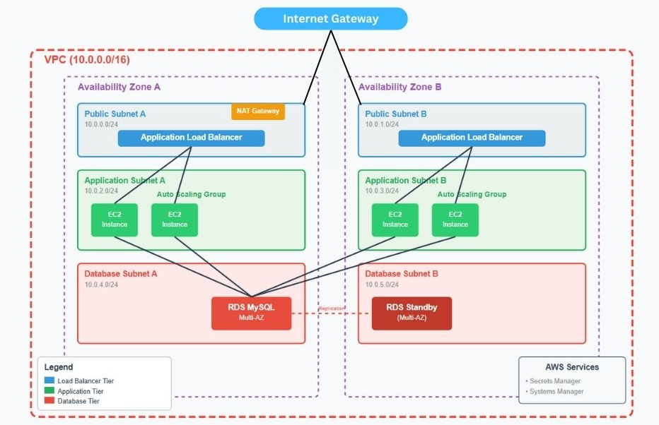

# Three-Tier AWS Application Infrastructure

Scalable three-tier web application infrastructure on AWS using Terraform.

## Architecture Overview

### **Tier 1: Load Balancer (Public Tier)**
- Application Load Balancer (ALB) in public subnets
- HTTP listener on port 80
- Health checks and target group management
- Internet-facing with public accessibility

### **Tier 2: Application (Private Tier)**
- Auto Scaling Group with EC2 instances
- Launch Template with Amazon Linux 2 AMI
- Private subnets across multiple Availability Zones
- Systems Manager (SSM) integration for secure instance management

### **Tier 3: Database (Private Tier)**
- MySQL 8.0 RDS instance with Multi-AZ deployment
- Database subnet group in isolated private subnets
- AWS Secrets Manager integration for credential management
- Automated backups and performance insights

### **Supporting Infrastructure**
- VPC with public and private subnets across multiple AZs
- NAT Gateway for outbound internet access from private subnets
- Security Groups with least-privilege access controls
- VPC Endpoints for SSM services
- Route tables and network ACLs
